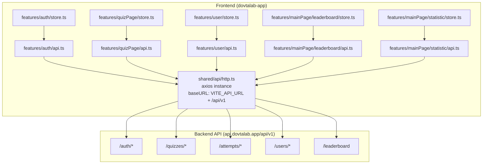
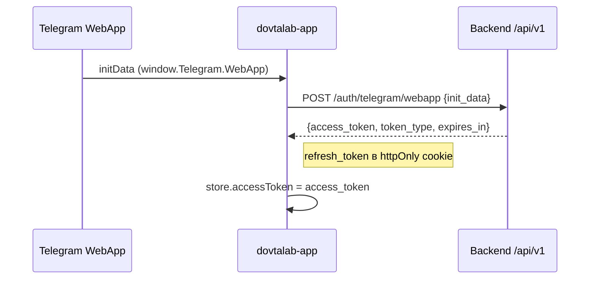
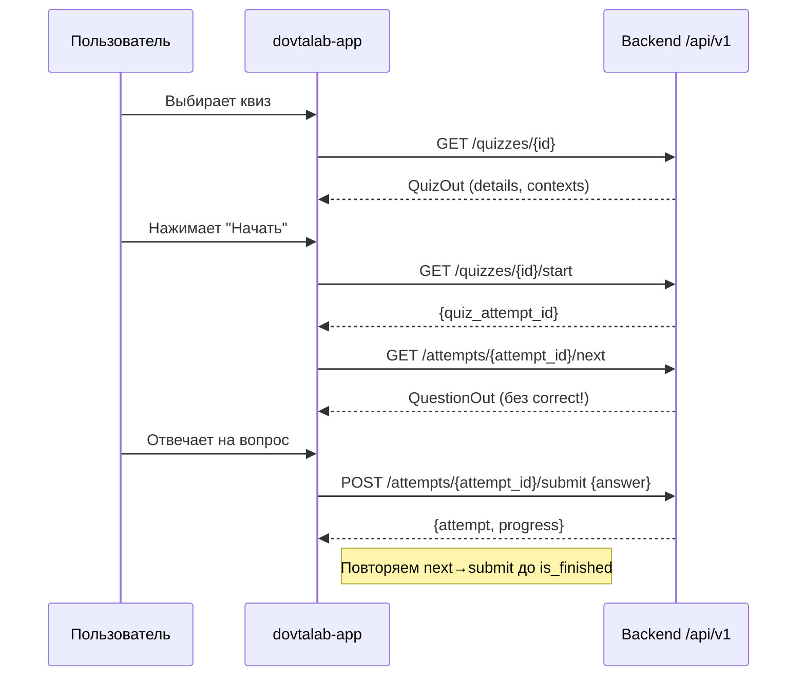
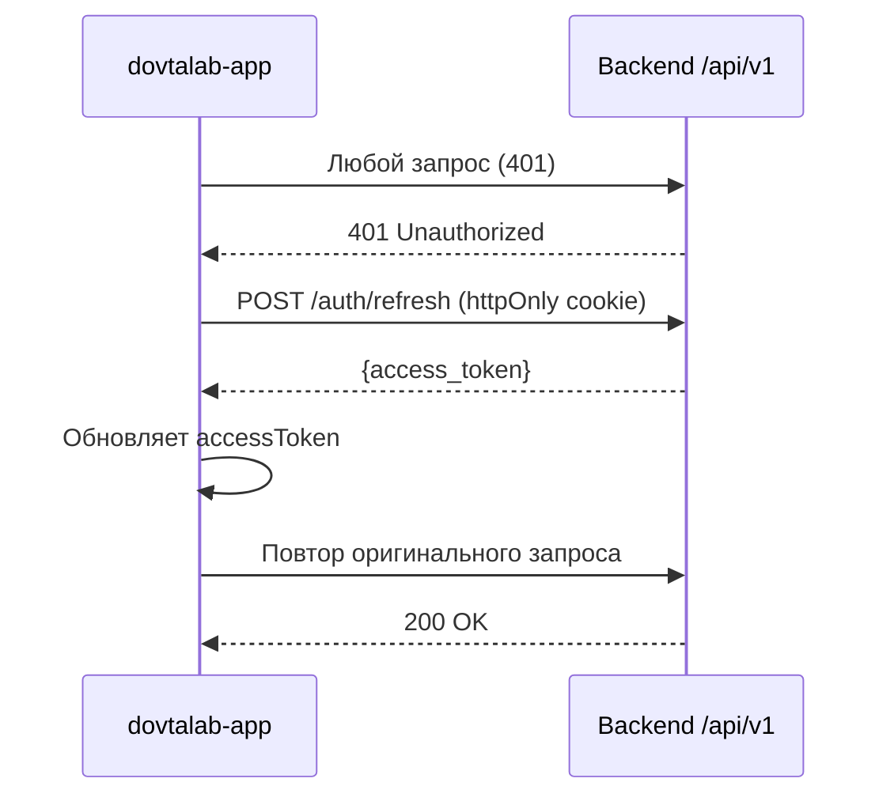

# Дизайн-документ: Platform API Refactoring

## Overview

Рефакторинг фронтенда платформы dovtalab-app для приведения в соответствие с обновлённым бэкенд API. Основные изменения: добавление `/api/v1` в baseURL, актуализация путей эндпоинтов, синхронизация TypeScript-типов с Pydantic-схемами бэкенда, и удаление лишней логики (статусов, поля `correct` в payload). 

Платформа — пользовательское приложение для прохождения квизов через Telegram Mini App / Capacitor. Работает исключительно с published-контентом, без доступа к модерации и управлению.

## Architecture



## Sequence-диаграммы

### Авторизация через Telegram WebApp



### Прохождение квиза



### Обновление access_token (interceptor)



## Components and Interfaces

### Компонент 1: HTTP-клиент (`shared/api/http.ts`)

**Назначение**: Единый axios instance с interceptors для авторизации и refresh.

**Текущая проблема**: `baseURL` не содержит `/api/v1`, что означает все пути в api-файлах должны совпадать с полными путями бэкенда.

**Целевой интерфейс**:
```typescript
const http = axios.create({
  baseURL: `${import.meta.env.VITE_API_URL ?? "https://api.dovtalab.app"}/api/v1`,
  withCredentials: true,
  timeout: 10000,
})
```

**Обязанности**:
- Устанавливать `Authorization: Bearer {token}` для каждого запроса
- Перехватывать 401, делать refresh через `POST /auth/refresh`
- При неудачном refresh — вызывать `auth.logout()`
- Обрабатывать сетевые ошибки

### Компонент 2: Auth API (`features/auth/api.ts`)

**Назначение**: Методы авторизации через Telegram.

**Текущая проблема**: Есть устаревшие эндпоинты (`/auth/telegram/native`, `/auth/test`, `/auth/code-access`).

**Целевой интерфейс**:
```typescript
// Telegram WebApp initData
export const telegramWebAppAuth = (data: { init_data: string }) =>
    http.post<AuthTokensResponse>('/auth/telegram/webapp', data)

// Telegram OAuth 2.0 (code + PKCE)
export const telegramOAuth = (payload: TelegramOAuthPayload) =>
    http.post<AuthTokensResponse>('/auth/telegram', payload)

// Refresh token (httpOnly cookie)
export const refreshToken = () =>
    http.post<{ access_token: string }>('/auth/refresh')

// Logout
export const logout = () =>
    http.post('/auth/logout')

// Dev-mode login (только в development)
export const devLogin = () =>
    http.post<AuthTokensResponse>('/auth/dev-login')
```

### Компонент 3: Quiz API (`features/quizPage/api.ts`)

**Назначение**: CRUD-операции с квизами, попытками и избранным.

**Текущая проблема**: Тип возврата `startQuiz` неверный — бэкенд возвращает `{quiz_attempt_id}`, а не `QuestionPublic`.

**Целевой интерфейс**:
```typescript
// Список published квизов
export const fetchQuizzes = () =>
    http.get<QuizOut[]>('/quizzes/')

// Детали квиза
export const getQuiz = (quizId: number) =>
    http.get<QuizOut>(`/quizzes/${quizId}`)

// Начать квиз → возвращает quiz_attempt_id
export const startQuiz = (quizId: number) =>
    http.get<StartQuizResponse>(`/quizzes/${quizId}/start`)

// Контексты квиза
export const getContexts = (quizId: number) =>
    http.get<ContextOut[]>(`/quizzes/${quizId}/contexts`)

// Следующий вопрос
export const nextQuestion = (attemptId: number) =>
    http.get<QuestionOut>(`/attempts/${attemptId}/next`)

// Отправить ответ
export const submitAnswer = (attemptId: number, answer: AnswerSubmit) =>
    http.post<SubmitResponse>(`/attempts/${attemptId}/submit`, answer)

// Статистика по квизу
export const getQuizStat = (quizId: number) =>
    http.get<QuizStat>(`/quizzes/${quizId}/my-stat`)

// Избранное
export const getFavorites = () =>
    http.get<QuizOut[]>('/quizzes/favorites')

export const addFavorite = (quizId: number) =>
    http.post(`/quizzes/${quizId}/favorite`)

export const removeFavorite = (quizId: number) =>
    http.delete(`/quizzes/${quizId}/favorite`)
```

### Компонент 4: User API (`features/user/api.ts`)

**Назначение**: Профиль, конфигурация, статистика.

**Целевой интерфейс**:
```typescript
export const getMe = () =>
    http.get<User>('/users/me')

export const getProfile = () =>
    http.get<UserProfileOut>('/users/profile')

export const getConfig = () =>
    http.get<UserConfig>('/users/config')

export const updateConfig = (data: Partial<UserConfig>) =>
    http.patch<UserConfig>('/users/config', data)

export const getStats = () =>
    http.get<UserStats>('/users/me/stats')

export const getAttemptHistory = (skip = 0, limit = 20) =>
    http.get<AttemptHistoryItem[]>(`/users/me/attempts?skip=${skip}&limit=${limit}`)
```

### Компонент 5: Leaderboard API (`features/mainPage/leaderboard/api.ts`)

**Назначение**: Рейтинг пользователей.

**Текущая проблема**: Путь без ведущего `/` — `leaderboard` вместо `/leaderboard`.

**Целевой интерфейс**:
```typescript
export const getLeaderboard = (period: Period = 'all', limit = 50) =>
    http.get<LeaderboardItem[]>(`/leaderboard?period=${period}&limit=${limit}`)

export const getQuizLeaderboard = (quizId: number) =>
    http.get<LeaderboardItem[]>(`/quizzes/${quizId}/leaderboard`)
```

## Data Models

### QuizOut (ответ бэкенда)

```typescript
interface QuizOut {
  id: number
  hash_code: string
  title: string
  description: string
  time_limit: number
  on_fav?: boolean
  created_at: string // ISO datetime
  contexts?: ContextOut[]
  details?: QuizDetails
}

interface QuizDetails {
  type?: QuestionType
  stat?: AttemptHistoryItem
}
```

**Правила валидации**:
- `id` > 0
- `time_limit` >= 0
- `hash_code` — непустая строка
- `contexts` — опционально, может быть `undefined`

### StartQuizResponse

```typescript
interface StartQuizResponse {
  quiz_attempt_id: number
}
```

**Правила валидации**:
- `quiz_attempt_id` > 0

### QuestionOut (response для platform — БЕЗ correct)

```typescript
type QuestionType = 'single_choice' | 'multiple_choice' | 'matching' | 'input'

interface QuestionOut {
  id: number
  text: string
  type: QuestionType
  context_id?: number
  payload: QuestionPayloadOut // НИКОГДА не содержит поле correct
  image_url?: string
  order: number
  attempt?: QuestionAttemptOut
}
```

**Правила валидации**:
- `payload` НИКОГДА не содержит `correct` — это серверная информация
- `type` определяет, какой ключ в `payload` не null

### QuestionPayloadOut (БЕЗ correct)

```typescript
interface QuestionPayloadOut {
  single_choice?: {
    options: Array<{ id: number; text: string; image_url?: string }>
    shuffle?: boolean
  }
  multiple_choice?: {
    options: Array<{ id: number; text: string; image_url?: string }>
    min_choices?: number
    max_choices?: number
    shuffle?: boolean
  }
  matching?: {
    left: Array<{ id: number; text: string }>
    right: Array<{ id: number; text: string }>
  }
  input?: {
    numeric: boolean
    case_sensitive?: boolean
  }
}
```

### AnswerSubmit (discriminated union)

```typescript
type AnswerSubmit =
  | { type: 'single_choice'; selected_option_id: number }
  | { type: 'multiple_choice'; selected_option_ids: number[] }
  | { type: 'matching'; pairs: Record<string, number> }
  | { type: 'input'; answer_text: string }
```

**Правила валидации**:
- `single_choice`: `selected_option_id` > 0
- `multiple_choice`: массив не пустой, все id > 0
- `matching`: все ключи — валидные строковые id, все значения > 0
- `input`: `answer_text` — непустая строка

### SubmitResponse

```typescript
interface SubmitResponse {
  attempt: QuestionAttemptOut
  progress: Progress
}

interface QuestionAttemptOut {
  id: number
  quiz_attempt_id: number
  question_id: number
  attempt_at: string
  answered_at?: string
  answer?: AnswerSubmit
  result?: AttemptResult
}

interface AttemptResult {
  is_correct: boolean
  correct_answer?: AnswerSubmit
  explanation?: string
}

interface Progress {
  correct_count: number
  earned_points: number
  is_finished: boolean
  score: number
  total_count: number
  total_questions: number
}
```

### ContextOut

```typescript
interface ContextOut {
  id: number
  title: string
  text: string
  rule?: string
  order: number
  detail?: { questions: number }
}
```

### AuthTokensResponse

```typescript
interface AuthTokensResponse {
  access_token: string
  token_type: 'bearer'
  expires_in: number
}
```

**Изменение**: `refresh_token` и `user` НЕ возвращаются в теле — refresh token в httpOnly cookie.

### UserProfileOut

```typescript
interface UserProfileOut {
  user: User
  config: UserConfig
  roles: UserRole[]
}

interface User {
  id: number
  first_name: string
  username: string
  last_name: string
  avatar_url: string
}

interface UserConfig {
  language: string
  is_active: boolean
  timer: boolean
  quiz_time: number
  quiz_count: number
}

type UserRole = 'creator' | 'pro' | 'admin'
```

### LeaderboardItem

```typescript
interface LeaderboardItem {
  rank: number
  user_id: number
  first_name: string
  username: string
  avatar_url: string
  total_points: number
}

type Period = 'all' | 'month' | 'week'
```

### UserStats

```typescript
interface UserStats {
  total_quizzes_completed: number
  total_questions_answered: number
  correct_answers: number
  accuracy_percent: number
}
```

### AttemptHistoryItem

```typescript
interface AttemptHistoryItem {
  quiz_attempt_id: number
  quiz_id: number
  quiz_title: string
  correct_count: number
  total_count: number
  score: number
  duration_sec: number
  started_at: string // ISO datetime
  finished_at: string // ISO datetime
  accuracy_percent: number
}
```

## Алгоритмы и ключевые функции

### Функция 1: Конфигурация HTTP-клиента

```typescript
function createHttpClient(): AxiosInstance {
  const instance = axios.create({
    baseURL: `${import.meta.env.VITE_API_URL ?? 'https://api.dovtalab.app'}/api/v1`,
    withCredentials: true,
    timeout: 10000,
  })
  // ... interceptors
  return instance
}
```

**Предусловия:**
- `VITE_API_URL` — валидный URL без trailing slash ИЛИ не задан (используется default)

**Постусловия:**
- `baseURL` всегда заканчивается на `/api/v1`
- Все относительные пути в api-файлах резолвятся относительно baseURL

**Влияние на пути**: После добавления `/api/v1` в baseURL, все пути в api-файлах уже работают корректно (они начинаются с `/`, что делает их абсолютными от baseURL origin). Единственная проблема — пути без ведущего `/` (как `leaderboard`) будут резолвиться относительно baseURL.

### Функция 2: Refresh Interceptor

```typescript
async function handleRefresh(error: AxiosError, instance: AxiosInstance): Promise<AxiosResponse> {
  const auth = useAuthStore()
  const originalRequest = error.config!

  // Не перехватываем ошибку самого refresh
  if (originalRequest.url?.includes('/auth/refresh')) {
    auth.logout()
    throw error
  }

  // Защита от двойного retry
  if ((originalRequest as any)._retry) throw error
  (originalRequest as any)._retry = true

  // Refresh через httpOnly cookie
  const { data } = await instance.post<{ access_token: string }>('/auth/refresh')
  auth.accessToken = data.access_token
  localStorage.setItem('access_token', data.access_token)

  // Повтор оригинального запроса
  originalRequest.headers!.Authorization = `Bearer ${data.access_token}`
  return instance(originalRequest)
}
```

**Предусловия:**
- `error.response.status === 401`
- Запрос не является самим refresh-ом
- Запрос ещё не был retry

**Постусловия:**
- При успешном refresh — оригинальный запрос выполнен повторно
- При неудачном refresh — вызван `auth.logout()`
- `accessToken` обновлён в store и localStorage

### Функция 3: Начало квиза (store action)

```typescript
async function startQuiz(quizId: number): Promise<number> {
  const { data } = await api.startQuiz(quizId)
  return data.quiz_attempt_id  // ← НЕ QuestionPublic!
}
```

**Предусловия:**
- `quizId` > 0
- Пользователь аутентифицирован
- Квиз опубликован

**Постусловия:**
- Возвращает `quiz_attempt_id` для дальнейших запросов
- НЕ возвращает первый вопрос (нужен отдельный вызов `nextQuestion`)

### Функция 4: Отправка ответа (store action)

```typescript
async function submitAnswer(attemptId: number, answer: AnswerSubmit): Promise<SubmitResponse> {
  const { data } = await api.submitAnswer(attemptId, answer)
  return data
}
```

**Предусловия:**
- `attemptId` — валидный id текущей попытки
- `answer.type` соответствует типу текущего вопроса
- Для `single_choice`: `selected_option_id` из списка options текущего вопроса
- Для `multiple_choice`: все id из списка options, количество в пределах min/max_choices
- Для `matching`: все left.id присутствуют как ключи, все right.id как значения
- Для `input`: `answer_text` непустая строка

**Постусловия:**
- `progress.is_finished === true` → квиз завершён
- `attempt.result.is_correct` — был ли ответ правильным
- `attempt.result.correct_answer` — правильный ответ (после ответа, для показа)

### Функция 5: Quiz Flow (composable)

```typescript
// Текущая логика не меняется, но startQuiz теперь двухшаговый:
async function startAndLoadFirstQuestion(quizId: number): Promise<void> {
  const attemptId = await quizStore.startQuiz(quizId)
  currentAttemptId.value = attemptId
  const question = await quizStore.nextQuestion(attemptId)
  currentQuestion.value = question
}
```

**Предусловия:**
- `selectedQuiz` не null
- Пользователь аутентифицирован

**Постусловия:**
- `currentAttemptId` содержит валидный attempt id
- `currentQuestion` содержит первый вопрос квиза

## Примеры использования

### Пример 1: Полный цикл авторизации (WebApp)

```typescript
// В App.vue / auth guard
const auth = useAuthStore()
const tgWebApp = window.Telegram?.WebApp

if (tgWebApp?.initData) {
  await auth.login(tgWebApp.initData)
  // accessToken сохранён, refresh в cookie
}
```

### Пример 2: Прохождение квиза

```typescript
const quizStore = useQuiz()

// 1. Загружаем детали
const quiz = await quizStore.getQuiz(42)

// 2. Стартуем — получаем attempt_id (НЕ вопрос!)
const attemptId = await quizStore.startQuiz(42)

// 3. Получаем первый вопрос
let question = await quizStore.nextQuestion(attemptId)

// 4. Отправляем ответ
const result = await quizStore.submitAnswer(attemptId, {
  type: 'single_choice',
  selected_option_id: 7
})

// 5. Проверяем прогресс
if (result.progress.is_finished) {
  // Показываем результат
} else {
  question = await quizStore.nextQuestion(attemptId)
}
```

### Пример 3: Leaderboard с фильтрацией

```typescript
const leadersStore = useLeadersStore()

// Глобальный рейтинг за неделю
await leadersStore.fetchLeaders('week', 50)

// Рейтинг по конкретному квизу
const { data } = await api.getQuizLeaderboard(42)
```

## Correctness Properties

*A property is a characteristic or behavior that should hold true across all valid executions of a system — essentially, a formal statement about what the system should do. Properties serve as the bridge between human-readable specifications and machine-verifiable correctness guarantees.*

### Property 1: baseURL всегда включает /api/v1

*For any* value of `VITE_API_URL` (including undefined), the resulting HTTP client baseURL SHALL end with `/api/v1`.

**Validates: Requirements 1.1, 1.2**

### Property 2: Все API пути начинаются с /

*For any* API path defined in any api module (auth, quiz, user, leaderboard), the path string SHALL start with a leading `/` character, ensuring correct resolution against the baseURL origin.

**Validates: Requirements 7.2, 6.3**

### Property 3: QuestionPayloadOut не содержит поле correct

*For any* `QuestionPayloadOut` object received or processed by the platform, none of the variant keys (`single_choice`, `multiple_choice`, `matching`, `input`) SHALL contain a `correct` field.

**Validates: Requirements 8.1, 10.2**

### Property 4: AnswerSubmit дискриминируется по type

*For any* valid `AnswerSubmit` object, the `type` field SHALL determine exactly which payload fields are present: `single_choice` → `selected_option_id`, `multiple_choice` → `selected_option_ids`, `matching` → `pairs`, `input` → `answer_text`.

**Validates: Requirements 8.2, 8.3, 8.4, 8.5, 8.6**

### Property 5: Refresh interceptor не зацикливается

*For any* failed request, if the request URL contains `/auth/refresh` OR the request has already been retried, the interceptor SHALL NOT attempt another refresh/retry — it SHALL invoke logout and reject.

**Validates: Requirements 2.4, 2.5**

### Property 6: Параметрические эндпоинты формируют правильные URL

*For any* positive integer ID passed to a parameterized API function (getQuiz, startQuiz, nextQuestion, submitAnswer, getQuizStat, getContexts, getQuizLeaderboard), the resulting request URL SHALL contain the ID in the correct path position and SHALL NOT include duplicate prefixes.

**Validates: Requirements 4.2, 4.3, 4.4, 4.5, 4.6, 4.8, 6.2, 7.3**

### Property 7: Двухшаговый quiz flow

*For any* quiz start flow, `startQuiz(quizId)` SHALL return only `quiz_attempt_id` (number > 0), and the subsequent `nextQuestion(attemptId)` SHALL be called with that ID to retrieve the first question. When `progress.is_finished === true`, no further `nextQuestion` calls SHALL be made.

**Validates: Requirements 9.1, 9.2, 9.3, 9.4**

## Error Handling

### Сценарий 1: Сетевая ошибка (нет интернета)

**Условие**: `!error.response || error.code === 'ERR_NETWORK'`
**Реакция**: Показать `message.error('Ошибка сети...')`
**Восстановление**: Пользователь повторяет действие

### Сценарий 2: 401 Unauthorized

**Условие**: `error.response.status === 401`
**Реакция**: Попытка refresh → повтор запроса
**Восстановление**: При неудачном refresh — logout и редирект на авторизацию

### Сценарий 3: 404 Not Found (квиз не найден)

**Условие**: `error.response.status === 404`
**Реакция**: Показать сообщение, вернуться к списку квизов
**Восстановление**: Обновить список квизов

### Сценарий 4: Timeout

**Условие**: `error.code === 'ECONNABORTED'`
**Реакция**: Показать `message.error('Время ожидания истекло...')`
**Восстановление**: Предложить повторить

## Testing Strategy

### Unit-тесты

- Проверка формирования URL в каждом api-файле
- Проверка типов ответов (TypeScript compile-time)
- Проверка логики refresh interceptor (mock axios)
- Проверка store actions (mock api)

### Property-Based Testing

**Библиотека**: fast-check

- Для любого `AnswerSubmit` — корректная сериализация по type
- Для любого `QuestionOut` — payload не содержит correct
- Для любого URL в api-файлах — начинается с `/`

### Integration-тесты

- E2E: авторизация → список квизов → прохождение квиза → результат
- Проверка refresh flow при истёкшем токене
- Проверка offline-обработки

## Безопасность

- Access token хранится в памяти (Pinia store) + localStorage (fallback)
- Refresh token — httpOnly cookie (не доступен из JS)
- `withCredentials: true` — cookie отправляются с каждым запросом
- Platform НИКОГДА не получает правильные ответы до отправки ответа пользователя
- Dev-login доступен ТОЛЬКО при `VITE_DEV_MODE=true`

## Зависимости

- **axios** — HTTP-клиент
- **pinia** — state management (Options API stores)
- **vue-router** — маршрутизация
- **ant-design-vue** — UI компоненты (message для уведомлений)
- **@capacitor/core** — мобильная платформа
